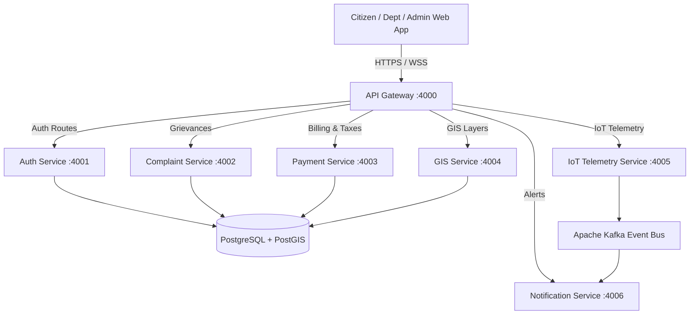

# SmartCity OS System Architecture Diagram

```mermaid
graph TD
    Client[Citizen / Dept / Admin Web App] -->|HTTPS / WSS| Gateway[API Gateway :4000]
    
    Gateway -->|Auth Routes| AuthSvc[Auth Service :4001]
    Gateway -->|Grievances| ComplaintSvc[Complaint Service :4002]
    Gateway -->|Billing & Taxes| PaymentSvc[Payment Service :4003]
    Gateway -->|GIS Layers| GISSvc[GIS Service :4004]
    Gateway -->|IoT Telemetry| IoTSvc[IoT Telemetry Service :4005]
    Gateway -->|Alerts| NotifSvc[Notification Service :4006]

    AuthSvc --> DB[(PostgreSQL + PostGIS)]
    ComplaintSvc --> DB
    PaymentSvc --> DB
    GISSvc --> DB
    IoTSvc --> Kafka[Apache Kafka Event Bus]
    Kafka --> NotifSvc
```
